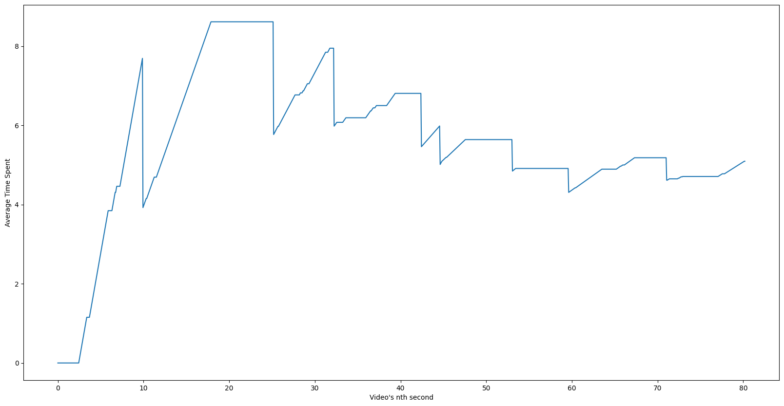

# Wisdom
## Wisdom is a retail video intelligence platform

Wisdom helps retail chains like DMART, Reliance Stores etc..,. to optimize their operations. One of the challenging problem is average customer time spent at billing counters. 

Billing counters are the choke point for customers who want to leave as early as possible, operations team want to have consistent flow of customers in and out. To fasten the billing process many Point of Sale counters are put up by operations team. But monitoring all these counters by an operations manager or branch head is cumbersome process and physical stores don't have any automatic alerts to inform the operations team if a specific counter is taking more time to process customer billing. They don't have daily reports of average customer waiting time for every counter in a given day.

Wisdom solves this problem by analysing CCTV Feed in real time and produces live trackable charts for each billing counter.

## Here are the Objectives:
[x] Create a time series graph and live banner of avg time spent in billing counter.

## Implementation:
[x] Read the video feed into python

[x] Define the bounding boxes for billing counter / rack

[x] Identify humans with bounding boxes in each frame and detect if they fall under billing counter / rack

[x] record number of frames that human is present in the pre-defined boxes

[x] Calculate avg wait time by (no: of total detected frames * frame time) / no: of humans

[x] To detect humans / track get an image encoder model and compare the bounding boxes images.

[x] Calculate avg video frame time

## Core Logic:
- Wisdom uses Deeplearning computer vision model (YOLOv8) to track each customer in the store.
- Each frame from the video is extracted and customer detection is performed.
- It accepts location of billing counters in rectangular coordinates relative to the Video.
- Calculates proportion of customer physical presence near billing counter.
- Refer to [common_area function](./wisdom/retail/time_spent.py) in the codebase that calculates the intersection region of the customer and billing counter.
- Frames are choosen whose proportion of intersection to billing counter region crosses a specific treshold and also a compound frame object is created containing unqiue customer_ids who are present in that specific frame.
- Each frame is annotated with reference boxes of customer, billing counter and intersection region to be stiched atlast for generating annotated video.
- Average time at each instance of the video is computed and plotted in a graph.
- Finally a video is generated with all the annotated frames by running on multiple threads.
- Look into [main.py](./main.py) for the whole flow
